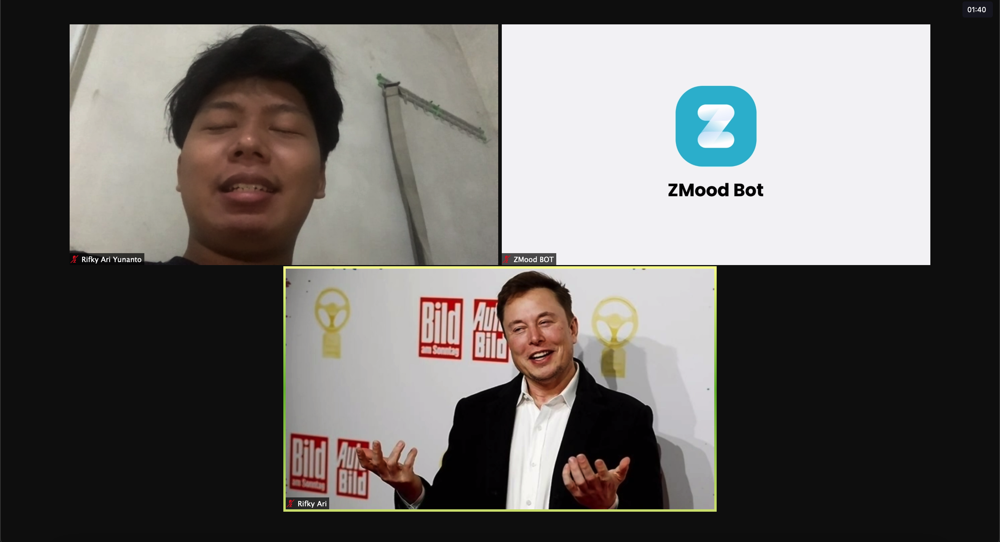
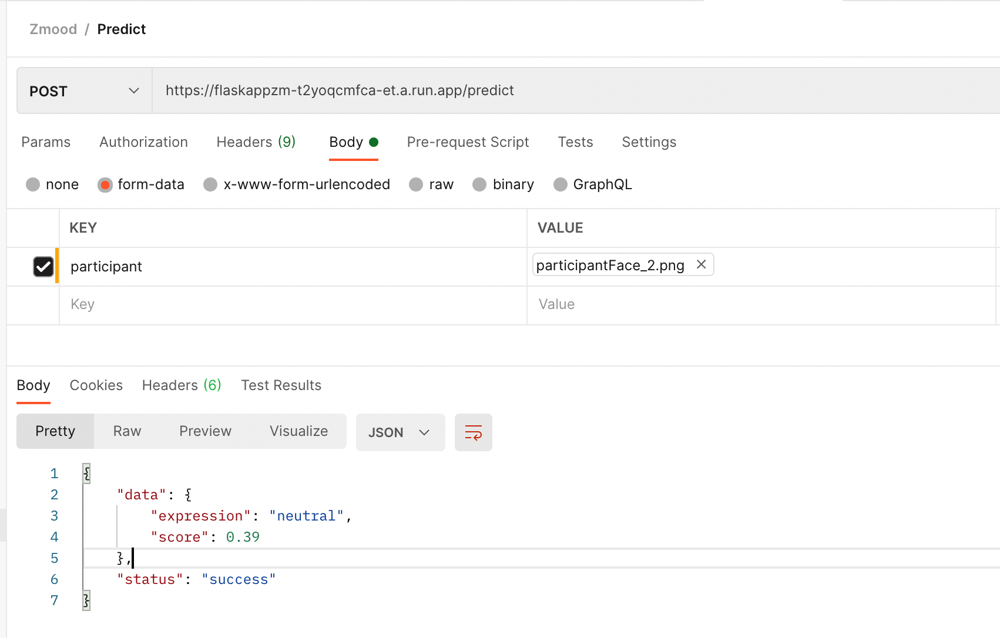

<!--
*** Thanks for checking out the Best-README-Template. If you have a suggestion
*** that would make this better, please fork the repo and create a pull request
*** or simply open an issue with the tag "enhancement".
*** Thanks again! Now go create something AMAZING! :D
***
***
***
*** To avoid retyping too much info. Do a search and replace for the following:
*** github_username, repo_name, twitter_handle, email, project_title, project_description
-->


<!-- PROJECT SHIELDS -->
<!--
*** I'm using markdown "reference style" links for readability.
*** Reference links are enclosed in brackets [ ] instead of parentheses ( ).
*** See the bottom of this document for the declaration of the reference variables
*** for contributors-url, forks-url, etc. This is an optional, concise syntax you may use.
*** https://www.markdownguide.org/basic-syntax/#reference-style-links
-->


<!-- PROJECT LOGO -->
<br />
<p align="center">
  <a href="https://github.com/github_username/repo_name">
    
  </a>

  <h3 align="center">ZMood Bot</h3>

  <p align="center">
    This is ZMood Bot. An Auto Report Zoom Meeting based on Face Expression Recognition to detect participant expression during online learning. we are using FER 2013 dataset to create the model to classify participant expression. This bot also can be used to evaluate the learning model and decide what kind of learning methods is most suitable to the participant. 
    <br />
    <br />
    <a href="https://github.com/rifkyariy/ZMoodBot"><strong>Explore the docs »</strong></a>
    <br />
  </p>
</p>


<!-- ABOUT THE PROJECT -->
## About The Project

<br/>


### Built With

* [Python 3.8.3](https://www.python.org/)
* [PyAutoGUI](https://pyautogui.readthedocs.io/en/latest/)
* [Open CV](https://opencv.org/)
* [Pillow](https://pillow.readthedocs.io/en/stable/)
* [Firebase Admin](https://pypi.org/project/firebase-admin/)
* [Flask](https://flask.palletsprojects.com/en/2.0.x/)


<!-- GETTING STARTED -->
## Getting Started

To get a local copy up and running follow these simple steps.

### Installation

1. Clone the repo
    ```sh
    git clone https://github.com/rifkyariy/ZMoodBot.git
    ```

2. Install Python and run: 
    ```sh
     pip3 install -r requirement.txt
    ```


<!-- USAGE EXAMPLES -->
## Usage

Use this space to show useful examples of how a project can be used. Additional screenshots, code examples and demos work well in this space. You may also link to more resources.
1. You can use our endpoint REST API to get current expression on image that sended via POST methods, use this endpoint link [Expression Endpoint  API](https://flaskappzm-t2yoqcmfca-et.a.run.app/predict)

<br/>
<br/>


<!-- ROADMAP -->
## Roadmap

See the [open issues](https://github.com/rifkyariy/ZMoodBot/issues) for a list of proposed features (and known issues).


<!-- CONTACT -->
## Contact

Project Link: [https://github.com/github_username/repo_name](https://github.com/rifkyariy/ZMoodBot)


<!-- ACKNOWLEDGEMENTS -->
## Acknowledgements
* [FER](https://github.com/justinshenk/fer)
* [Mood for Zoom](https://github.com/DrakeLin/MoodforZoom)
* [Facial-Expression-Recognition-with-CNNs](https://github.com/NJNischal/Facial-Expression-Recognition-with-CNNs)


